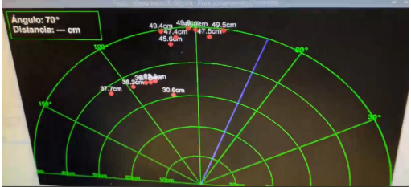

# 📡 Radar Ultrasónico con Raspberry Pi

## 📝 Descripción

Este proyecto implementa un sistema de radar utilizando un sensor ultrasónico **HC-SR04** y un servo motor **SG90**, controlados por una **Raspberry Pi**. La interfaz gráfica muestra en tiempo real los objetos detectados dentro de un rango de **0° a 180°**, indicando sus respectivas distancias.

---

## 🛠 Componentes Requeridos

- Raspberry Pi (cualquier modelo con GPIO)
- Sensor ultrasónico HC-SR04
- Servo motor SG90
- Protoboard y cables dupont
- Fuente de alimentación para Raspberry Pi

---

## 🔌 Diagrama de Conexiones

### 🔄 Conexiones del Servo Motor SG90

| Raspberry Pi (Pin) | Función     | Servo Motor SG90 | Color del Cable     |
|--------------------|-------------|------------------|---------------------|
| GPIO18 (Pin 12)    | Señal PWM   | Señal            | Amarillo/Naranja    |
| 5V (Pin 2)         | Alimentación| Vcc (+)          | Rojo                |
| GND (Pin 6)        | Tierra      | GND (-)          | Marrón/Negro        |

### 📡 Conexiones del Sensor Ultrasónico HC-SR04

| Raspberry Pi (Pin) | Función     | HC-SR04          | Color del Cable     |
|--------------------|-------------|------------------|---------------------|
| GPIO23 (Pin 16)    | Trig        | Trig             | Verde               |
| GPIO24 (Pin 18)    | Echo        | Echo             | Azul                |
| 5V (Pin 4)         | Alimentación| Vcc              | Rojo                |
| GND (Pin 20)       | Tierra      | GND              | Negro               |

---

## 🖥 Instalación

Clona el repositorio:

- git clone https://github.com/RobertoMeraz/Radar-Ultrasonico.git
- cd Radar-Ultrasonico

- sudo apt-get update
- sudo apt-get install python3-pip python3-pygame
- pip3 install RPi.GPIO #nota: si no deja usar pip utilizar un entorno virtual.

- python3 radar.py
---

## 🖼 Vista de la Interfaz en Ejecución

A continuación se muestra una captura de pantalla del radar funcionando en tiempo real:

